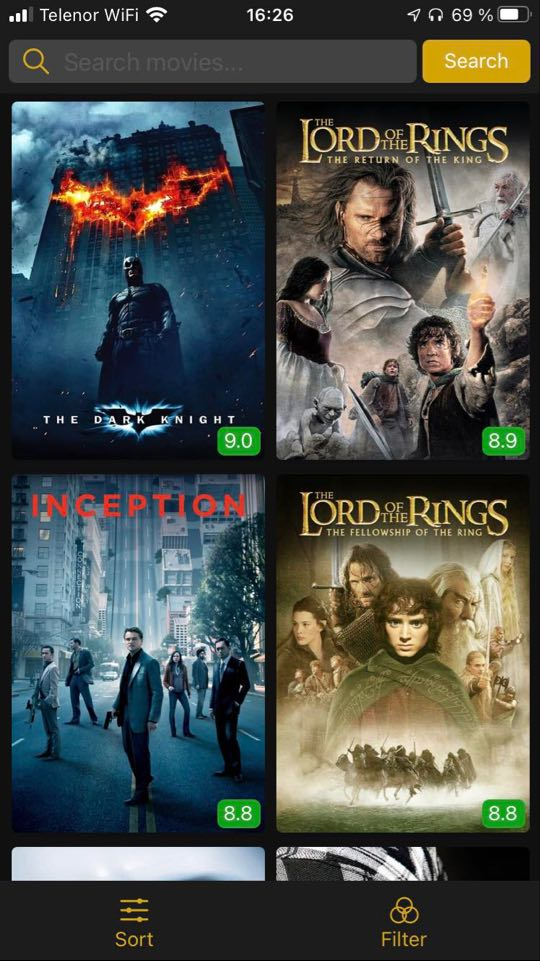

# 

# MovDB - En filmdatabaseapplikasjon

Mobil-applikasjonen MovDB skaffer brukere informasjon om over 2000 filmer! Gjennom søkefeltet øverst i appen, kan brukerne finne filmer ved å skrive inn nøkkelord fra filmens tittel eller beskrivelse. Deretter kan de trykke på de enkelte filmene fra resultatet av søket. Da åpnes en popup, hvor brukeren kan se hvilke produksjonsselskap som lagde den, se hvilke(t) land filmen ble spilt inn i og se lengden av filmen. Hvis brukeren ikke leter etter én bestemt film, kan den bruke applikasjonens filtrering og sortering til å finne filmer den vil se. Mens det er mulig å sortere på rating, lengde og lanseringsdato, kan man filtrere filmer på sjangre, produksjonsselskap, lanseringsdato og lendge. For å laste inn flere filmer som passer til søket/sorteringen/filtreringen, scroller man ned til bunnen av appen.  

<div align="center">
    
</div>


## Installering og kjøring

Ved å følge instruksjonene under, vil du kunne kjøre prosjektet på din mobil. 

### Forutsatte nødvendigheter

Følgende er nødvendig for å kunne kjøre prosjektet:

- [Node.js and npm](https://nodejs.org/en/download/)

For å få mest ut av appen må du bruke Iphone 7 eller nyere med >= iOS 10

### Installering

#### 1 - Klon prosjektet
Åpne en terminal, og naviger til mappen du ønsker å installere prosjektet i.
Klon repoet ved å skrive: 

```
git clone https://gitlab.stud.idi.ntnu.no/aleksawk/prosjekt-4
```

#### 2 - Installer og kjør appen:
1. Åpne en ny terminal

2. I prosjektets rotmappe: 
    ``` 
    ...\movDB
    ```
    
3. Installer avhengighetene til appen med: 
    ``` 
    npm install
    ```
    
4. Start expo med: 
    ``` 
    expo start
    ```
5. Last ned expo appen på din mobil

6. Ta bilde av QR-koden på [localhost](http://localhost:19002/)
    * Sørg for at mobilen og PC er på samme nettverk
    * På grunn av en bug i NativeBase biblioteket fungerer ikke expo web/simulator for tiden. Bruk expo appen. 

# Dokumentasjon

## React og React Native

Prosjektet er basert på Node.js og jeg har brukt expo init scriptet for å sette opp prosjektet med Typescript som spesifisert språk. I dette prosjektet har det i stor grad blitt tatt i bruk tredjepartskomponenter for å bygge appen. I hovedsak dreier dette seg om grunnleggende komponenter fra NativeBase, men også andre komponenter som for eksempel react-native-modal som er en forbedring av react native sin modal, og react-native-multi-slider for å la brukeren sette verdintervaller. Ellers er Apollo og graphQL også merkverdige tredjepartsbiblioteker, men ikke hovedfokuset for dette prosjektet. 

## Bruk av tredjepartskomponenter

Jeg valgte å bruke NativeBase sitt komponentbibliotek fordi jeg leste flere steder at det var bra, og det ble rangert høyt over biblioteker som man burde ta i bruk hvis man skulle skrive react native apper. Min personlige erfaring var for det meste positiv. Det er dessverre noen bugs som gjorde utviklingen vanskeligere enn den burde ha vært. Heldigvis har NativeBase et aktivt miljø, og det var derfor enkelt å finne ut hvordan man burde håndtere dette. NativeBase førte til en mer effektiv utviklingsprosses der jeg kunne teste ut løsninger raskt. Dette var noe jeg også fokuserte på gitt den relativt korte tidsrammen for prosjektet. 

Når det kommer til de andre tredjepartskomponentene ble de funnet via google søk som ledet enten til andre react native biblioteker eller enkle npm pakker. Hovedfokus var såklart å finne noe som fungerte godt på iOS og Android. Jeg ønsket også å finne komponenter med props og output lik de komponentene som ble brukt i prosjekt 3, da dette ville gjøre utviklingen mest effektiv. Dette var ikke noe problem å få til gitt at funksjonaliteten jeg trengte var veldig standard. 

## Gjenbruk fra MovDB-webappliksjonen

Som sagt var effektivitet i utviklingen viktig gitt den korte tidsrammen. Derfor ble MovDB sin web implementasjon brukt jevnt gjennom hele utviklingsprosessen. Siden react native er et rammeverk som oversetter native kode slik at den fungerer på forskjellige mobiler var det såklart ikke mulig å bruke noe av frontend html koden fra prosjekt 3. Hovedoppgaven var da å ta frontend JS-kode fra prosjekt 3, og legge til et nytt react native brukergrensesnitt som kunne kobles til denne koden. Denne prosessen lot seg gjøre for all funksjonaliteten som ble tatt med i appen. Dette var fordi vi hadde fokus på kodekvalitet i p3, og det var derfor ingen teknisk gjeld som førte til utfordringer når noe måtte fungere på en litt annen måte i appen. 

## Brukergrensesnitt

Brukergrensesnittet til appen er inspirert av diverse standarder som brukes i dagens mobilappliksjoner. MovDB sitt webdesign, med all funksjonalitet i header, hadde blitt trangt, og kronglete å operere med fingre. Derfor ble noe av denne funksjonaliteten satt i en navbar i bunnen av skjermen. Dette gjør det enklere å bruke appen med kun tommelen. Når det kommer til sortering og filtrering ble disse håndtert på samme måte som på web, men med et mobilvennelig design. Sorteringsmenyen fungerer fremdeles som en popup, men kan lukkes med swipe down. 

Interaksjonsdesign ble også prioritert ved å legge til haptic feedback ved alle events som førte til en endring i movieContainer sin tilstand. Dette var for å kommunisere til brukeren at handlingen hadde en effekt og at trykket har blitt registrert, noe som kan være vanskeligere å vite når man ikke bruker tastatur. 

## Testing

Appen har blitt manuelt end-2-end testet ved å bruke all funksjonaliteten om hverandre på flere forskjellige måter. Her har fokuset vært på at de riktige filmene vises, at pages laster inn korrekt, og at input blir tatt hånd om riktig. Et eksempel på en manuel e2e-test var å legge til et sjangerfilter, f.eks. «Crime», og sjekke om movieContainer kun inneholdt riktige filmer. Deretter ble sortering testet ved å sortere dette utvalget. Søk ble også testet for å sjekke at det fungerte korrekt. MovDB web ble brukt for å sammenligne resultater. Det skal også sies at koden i p3 hadde blitt testet grundig allerede, og at dette ble tatt i betraktning når jeg vurderte hvor grundig jeg skulle teste. 

## Verktøy og tredjepartskomponenter

* [React](https://reactjs.org/)
* [React Native](https://reactnative.dev/)
* [NativeBase](https://nativebase.io/)
* [Apollo Client](https://www.apollographql.com/docs/react/)
* [GraphQL](https://graphql.org/)
* [Apollo Server](https://www.apollographql.com/docs/apollo-server/)
* [MongoDB](https://www.mongodb.com/)
* [React-native-multi-slider](https://openbase.io/js/@ptomasroos/react-native-multi-slider)
* [React-native-popup-dialog](https://reactnativeexample.com/a-highly-customizable-react-native-popup-dialog/)
* [React-native-chip-input](https://github.com/ramprasath25/react-native-chips)
* [React-native-modal](https://github.com/react-native-modal/react-native-modal)

# Bidragsytere

* **Aleksander** - aleksawk@stud.ntnu.no - Gitlab: [aleksawk](https://gitlab.stud.idi.ntnu.no/aleksawk)